# BinaryExplorer

A WinUI3 desktop app for inspecting Windows binaries (.exe / .dll / .sys / .winmd / .msi) without running them — language detection, signatures, hashes, imports, capabilities, ETW providers, strings/IOCs, packing, resources, disassembly, decompilation, embedded files, and more. Includes an MCP server so AI clients can drive the same inspectors.

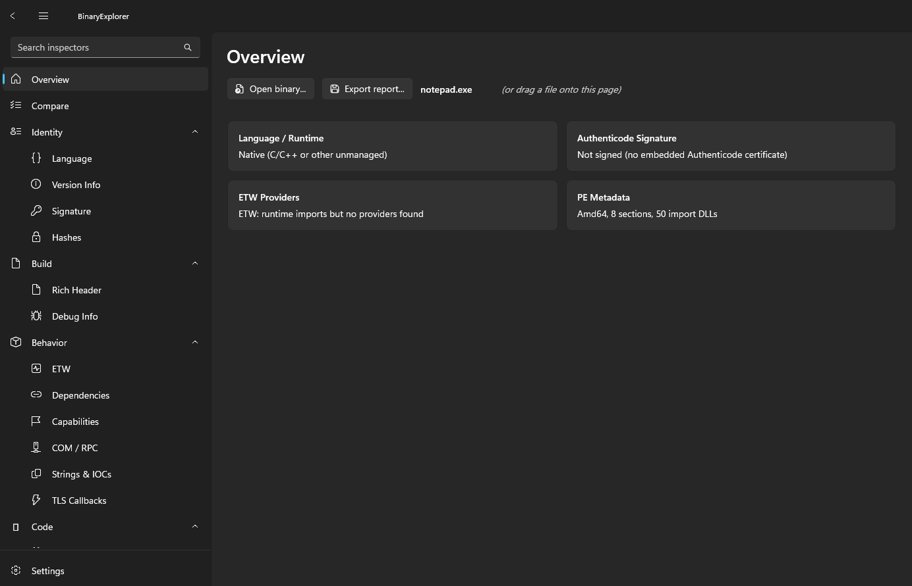

## Download

Grab the latest build from the [Releases page](https://github.com/guscatalano/BinaryExplorer/releases) — x64 and ARM64:

- **MSI** (`BinaryExplorer-<arch>.msi`) — self-contained installer; no .NET runtime required.
- **MSIX** (`BinaryExplorer-<arch>-msix.zip`) — extract and run `Install.ps1`. The package is signed with a self-signed certificate; install the bundled `.cer` into *Trusted People* first.

## What's in here

| Area | Inspectors |
| ---- | ---------- |
| Identity | Language detection, Version info, Authenticode signature, Hashes (incl. imphash + Authenticode SHA-256) |
| Build | Rich header (MSVC compiler fingerprint), Debug info (PDB path + GUID + symstore hash) |
| Behavior | ETW providers (manifested + TraceLogging GUID scan + `wevtutil`), Dependencies (imports/exports), Capabilities (Process Injection, Anti-Debug, Crypto, Network, etc.), COM / RPC interfaces, Strings & IOCs (URLs, IPs, domains, registry paths, mutexes…), TLS callbacks |
| Code | C# decompilation (ICSharpCode.Decompiler), x86/x64 disassembly (Iced) with function detection, local labels, xrefs, hyperlinkable jumps, back/forward history |
| Structure | PE headers, PE resources tree, Packing (Shannon entropy + UPX/ASPack/Themida/VMProtect/Enigma/PEtite/MPRESS/PECompact/NsPack/FSG), Embedded file scan, MSI tables, Hex view |
| Provenance | Mark of the Web (Zone.Identifier ADS + full ADS enumeration), VirusTotal (SHA-256 lookup), YARA (auto-download or shell out to `yara.exe`) |
| Tools | GUID lookup, cross-references, byte/string search, section dump, Mermaid diagrams; side-by-side compare; Markdown / JSON report export; drag-and-drop loading |

The whole-binary analyzer (`Analysis/PeAnalysis.cs`) does a linear sweep of executable sections in `Iced` to find every `call` target and build an xrefs map. That feeds the IDA-style **Disassembly** page with a function sidebar, search filter, and clickable jump annotations.

## Screenshots

| | |
| --- | --- |
| 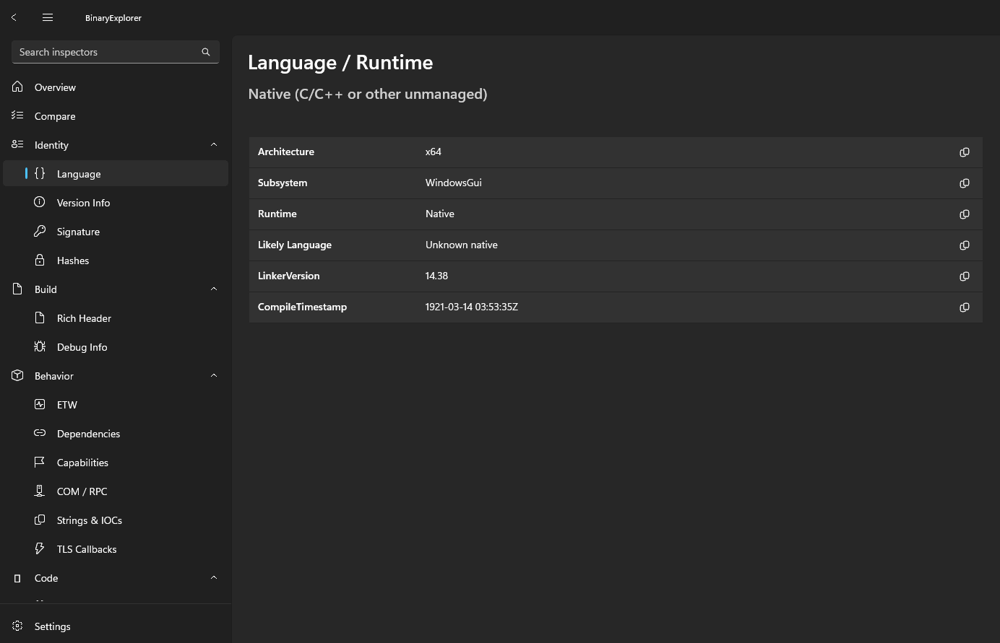 | 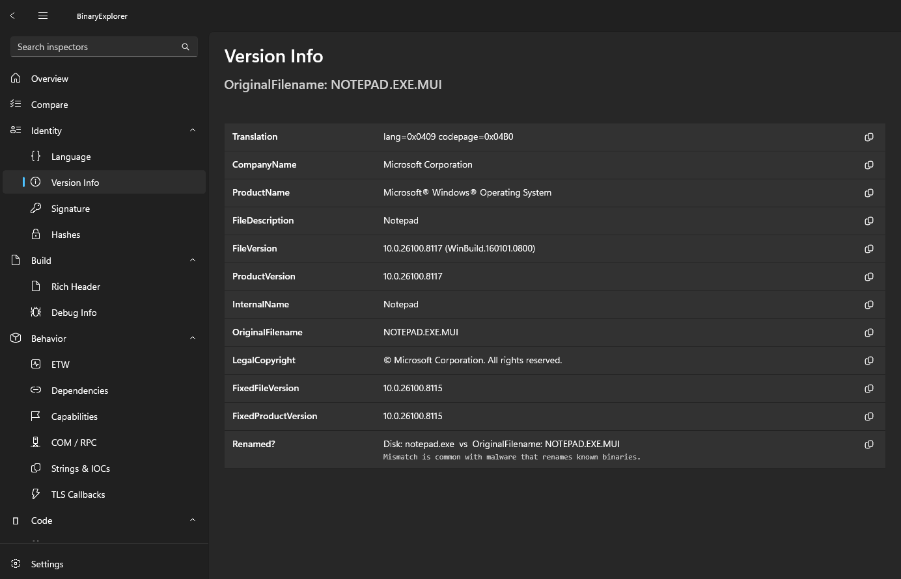 |
| 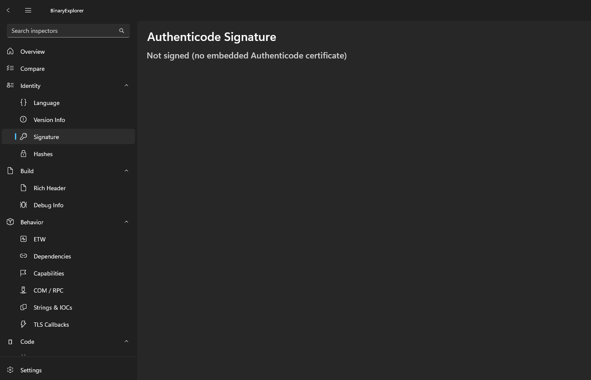 | 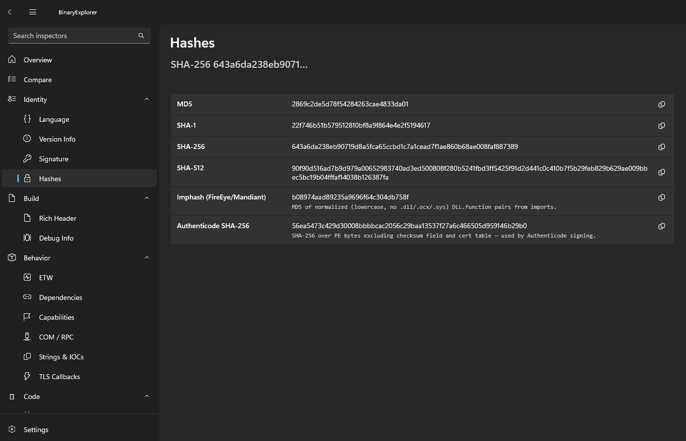 |
| 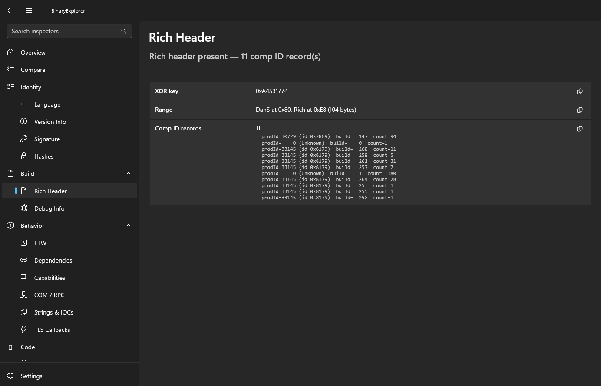 |  |
|  | 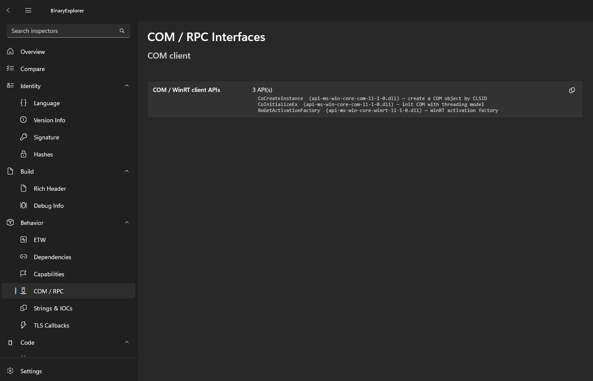 |
| 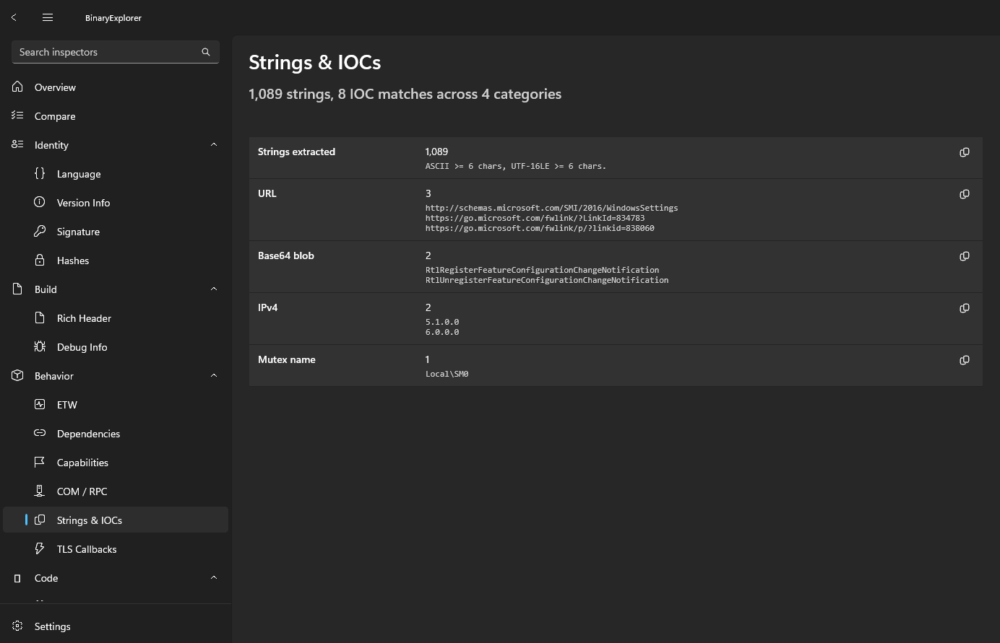 | 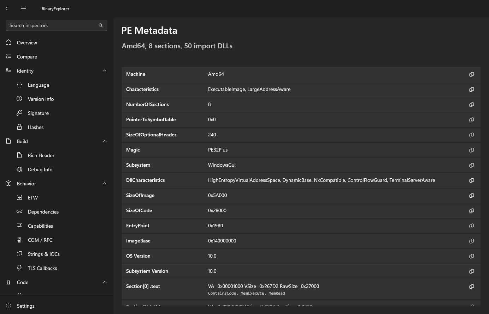 |
| 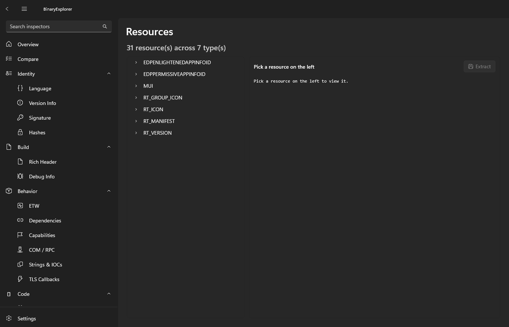 |  |
| 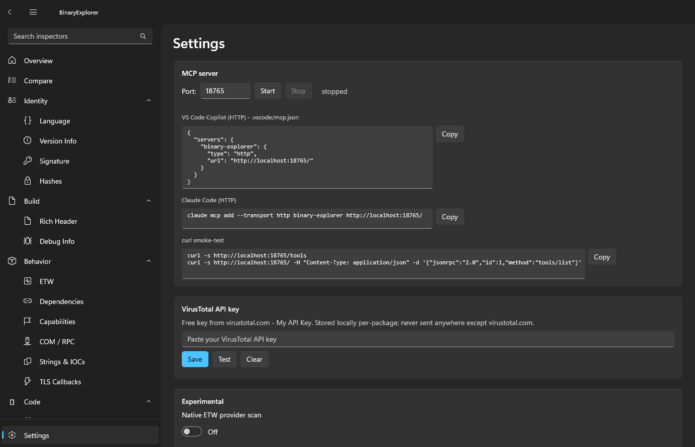 |  |

## MCP server

`Settings → MCP server` starts an HTTP MCP server **inside** the WinUI3 process via `HttpListener`. Tools are wired straight to the existing inspector pipeline — `inspect`, `disassemble`, `find_xrefs_ex`, `summarize_import_usage`, `get_call_graph_ex`, `architecture_evidence_pack`, and more. Set a current target once with `set_current_target` and the rest of the tools can omit the `path` argument. Sample configs for VS Code Copilot, Claude Code, and curl are right there with one-click copy.

## Building

Requires the .NET 10 SDK and Windows 10.0.17763 or newer.

```pwsh
dotnet build -p:Platform=x64
dotnet run   -p:Platform=x64
```

Helper scripts:

- `build-packages.ps1` — builds the signed MSIX and the WiX MSI locally.
- `take-screenshots.ps1` — captures the README screenshots automatically.

## Layout

```
Analysis/             — whole-binary linear-sweep analyzer (functions + xrefs)
Assets/               — app icon set
Controls/             — reusable XAML controls (FindingsList, HexView, InspectorResultView)
Core/                 — Finding, InspectionResult, BinaryContext, EmbeddedHit, ComparisonRow
Inspectors/           — one class per inspector
Pages/                — one nav page per inspector + Overview / Compare / Tools / Settings
Services/             — AppState, BinaryLoader, ReportExporter, GuidResolver, YaraScanner,
                        Settings, Mcp/{McpHttpServer,Dispatcher,Tools,Session}
installer/            — WiX v5 source for the MSI
.github/workflows/    — CI (build) and Release (MSIX + MSI) pipelines
```

## License

MIT — see [`LICENSE`](LICENSE).
